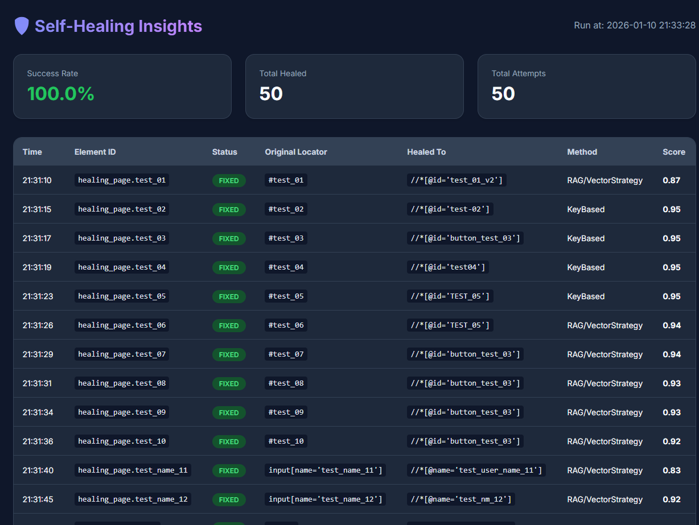

# Karate Enterprise Framework (Core)

An advanced automation framework built on top of the **Karate Framework**, extending its capabilities for Enterprise-grade Web and Mobile automation. This project provides custom driver implementations, advanced element handling, and a sophisticated AI-powered self-healing mechanism.

## 🚀 Key Features

### 1. Custom Driver Extensions
Extended drivers that provide additional functionality without breaking existing Karate APIs:
- **ChromeCustom**: Advanced web automation with network interception, improved Shadow DOM support, and deep integration with self-healing.
- **AndroidCustom & IosCustom**: Enhanced mobile automation for native apps.

### 2. Multi-Layered Self-Healing
A robust mechanism that automatically fixes broken locators during test execution:
- **Golden State Capture**: Automatically records element metadata (attributes, text, structural position, and vector embeddings) during successful runs.
- **AI-Powered Matching (RAG)**: Uses **TensorFlow Lite** and **Vector Embeddings** to semantically identify elements even when IDs or structures change.
- **Scoring Strategies**: Combines multiple strategies (Exact Attribute, Text-based, Structural, Neighbor, and Semantic) to calculate the best candidate match.
- **Zero-Maintenance**: Significantly reduces script maintenance effort as UI evolves.

### 🤖 Amazon Q & AI Assistance
The project is optimized for **Amazon Q** to assist developers throughout the automation lifecycle with custom contexts and rules:
- **Custom Chat Modes**: Specialized agents like `karate-healer`, `karate-generator`, `karate-planner`, and `karate-executor`.
- **Intelligent Knowledge Base**: Pre-indexed context (`.amazonq/knowledge`) for faster troubleshooting and framework-specific fixes.
- **Agentic Workflows**: Standardized AI prompting rules for generating, debugging, and reporting test results.

### 📊 Healing Insights Report
After each test execution, a detailed dashboard is generated to provide visibility into the healing actions taken:
- **Location**: `target/healing-report.html`
- **Features**: Success rates, original vs. healed locators, strategy scores, and timestamps.



### 3. Advanced Platform Utilities
- **Flexible Waiting**: Custom wait mechanisms for attributes, text, and element existence.
- **Complex Element Handling**: Specialized services for Tables, DropLists, and Shadow Elements.
- **Network Monitoring**: Capture and analyze XHR/API requests/responses directly through the custom driver.

## 📁 Project Structure

```text
src/main/java/core/
├── healing/          # Self-healing engine, AI strategies, and RAG components
├── platform/
│   ├── web/          # ChromeCustom driver and web-specific element services
│   ├── mobile/       # Android and iOS custom driver implementations
│   └── common/       # Shared configurations and constants
└── mcp/              # Multi-process / Protocol integrations
```

## 🛠️ Configuration

The healing behavior can be managed via `healing-config.yml`:
```yaml
# Self-healing switch
enabled: true

# Advanced modes
captureGoldenState: true
semanticMode: "HYBRID"
healingMode: "SAFE" # Options: SAFE, RECKLESS

# Strategies ordered by importance
strategies:
  - ExactAttributeStrategy
  - TextBasedStrategy
  - RagHealingStrategy
  - StructuralStrategy
```

## 📊 Documentation
- [Self-Healing Setup](HEALING_SETUP.md)
- [Healing Strategies Deep Dive](healing_strategies.md)

---

© 2025 Core Platform. All rights reserved.  
📧 Email: ngovanduy1991@gmail.com
