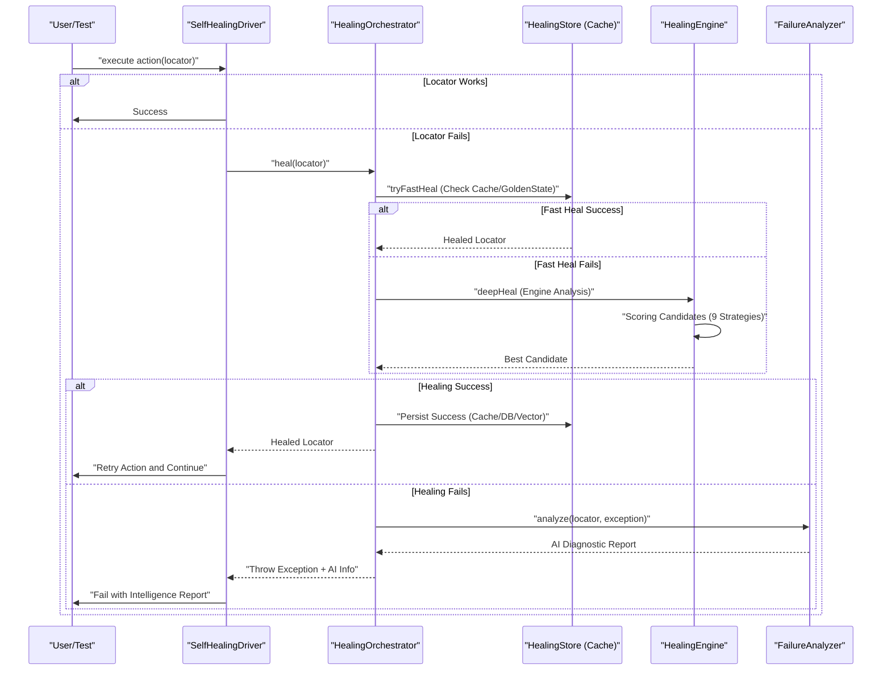
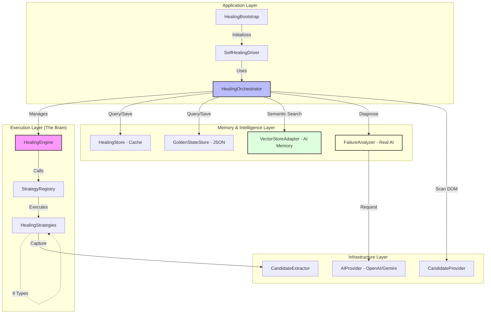
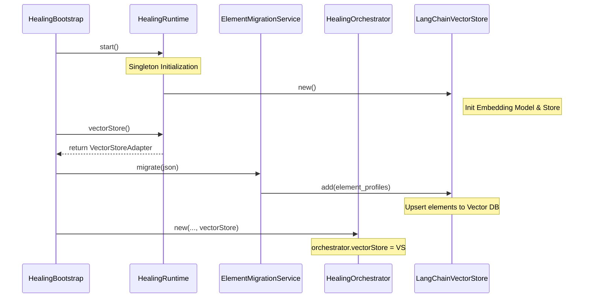

# 🏥 Healing Strategies Documentation

Tài liệu này giải thích chi tiết về **9 chiến thuật chữa lỗi (Strategies)** và công thức tính toán độ tin cậy được sử dụng trong hệ thống Self-Healing của Karate Framework.

---

## 📊 1. Danh sách các Strategy & Trọng số (Weights)

Hệ thống sử dụng cơ chế chấm điểm đa tầng để tìm ra ứng cử viên đúng nhất. Trọng số (Weight) thể hiện mức độ ưu tiên của Strategy đó.

| Nhóm | Strategy Name | Weight | Vai trò & Mục đích |
| :--- | :--- | :---: | :--- |
| **Lexical** | `ExactAttribute` | **1.00** | So khớp tuyệt đối ID, Name, data-testid. |
| **Lexical** | `KeyBased` | **0.95** | Hiểu các biến thể đặt tên (Vd: `txtUser` vs `username`). |
| **AI/Vector**| `RagHealing` | **0.95** | **[AL Brain]** Dùng AI Vector để hiểu ngữ cảnh phần tử. |
| **Lexical** | `TextBased` | **0.92** | So khớp Text hiển thị (Vd: "Login", "Đăng nhập"). |
| **Structure**| `Structural` | **0.90** | **[Backbone]** Kiểm tra vị trí DOM, Cha-Con, Form. |
| **Lexical** | `CrossAttribute`| **0.90** | Nhận diện khi giá trị nhảy từ Attr này sang Attr kia. |
| **AI/NLP**   | `SemanticValue` | **0.85** | Dùng AI hiểu từ đồng nghĩa (Vd: "Add" ~ "Create"). |
| **Context**  | `Neighbor` | **0.80** | Xác nhận qua phần tử hàng xóm (Vd: Label bên cạnh). |
| **Visual**   | `VisualHealing` | **0.35** | **[Last Resort]** So sánh hình ảnh pixel (SSIM). |

---

## 🧠 2. Công thức Độ tin cậy (Confidence)

Hệ thống không chỉ tin vào điểm số cao nhất, mà nó tổng hợp ý kiến từ "hội đồng chuyên gia" thông qua công thức **45-35-20**:

$$Confidence = (45\% \times Mean) + (35\% \times Max) + (20\% \times PassRatio)$$

1.  **45% Mean (Sức mạnh tập thể)**: Điểm trung bình của tất cả strategy. Đảm bảo phần tử "tốt đều" ở nhiều mặt.
2.  **35% Max (Đỉnh cao cá nhân)**: Cho phép 1 Strategy xuất sắc (Vd: RAG) cứu phần tử nếu các cái khác thất bại.
3.  **20% PassRatio (Sự đồng thuận)**: Niềm tin tăng lên khi nhiều Strategy cùng đồng ý chọn ứng cử viên đó.

> [!IMPORTANT]
> **Role Check**: Kết quả cuối cùng luôn được nhân với `roleScore`. Nếu ứng cử viên là `Button` trong khi gốc là `Input`, điểm sẽ về 0 ngay lập tức để tránh heal nhầm loại phần tử.

---

## 🛠️ 3. Nhóm thuộc tính (Attribute Groups)

Để tối ưu việc so khớp, hệ thống phân loại các thuộc tính HTML thành 3 nhóm chính:

*   **IDENTITY (Định danh)**: `id`, `name`, `data-testid`, `formcontrolname`. (Độ tin cậy cao nhất).
*   **LABEL (Nhãn)**: `aria-label`, `placeholder`, `title`, `text`. (Dùng cho AI và NLP).
*   **ROLE (Vai trò)**: `type`, `role`. (Dùng để kiểm soát tư cách phần tử).

---

## ⚙️ 4. Tùy chỉnh (Tuning Guide)

Bạn có thể điều chỉnh chế độ hoạt động trong `healing-config.yml`:

*   **Chế độ An toàn (healingMode: SAFE)**: (Mặc định) Ưu tiên sự ổn định cao nhất, bắt buộc AI phải kiểm tra nhiều yếu tố (45% Mean / 35% Max).
*   **Chế độ Liều lĩnh (healingMode: RECKLESS)**: Ưu tiên sự nhạy bén, tin tưởng vào dấu hiệu tốt nhất còn sót lại (35% Mean / 45% Max).

Bạn cũng có thể thay đổi nhanh qua command line: `-Dhealing.mode=RECKLESS`.

---

## 🔄 5. Luồng xử lý (Healing Workflow)

Dưới đây là sơ đồ trình tự (Sequence Diagram) mô tả cách hệ thống tự chữa lỗi khi một bước kiểm thử thất bại.

---

## 🏗️ 6. Sơ đồ lớp (Class Execution Flow)

Kiến trúc phân tầng đảm bảo tính tách biệt giữa việc điều phối, thực thi thuật toán và lưu trữ.

---

## 🛠️ 6. Luồng khởi tạo & Tương tác (Interaction Flow)

Sơ đồ trình tự dưới đây mô tả chi tiết cách các thành phần trong hệ thống được khởi tạo và tương tác với nhau trong giai đoạn khởi động (Bootstrap).

---
* Tài liệu này được cập nhật để phản ánh trạng thái tối ưu nhất của Healing Engine hiện tại.*
* Cài thêm plugin Mermaid để hiển thị sơ đồ đúng cách trong trình đọc Markdown hỗ trợ.
